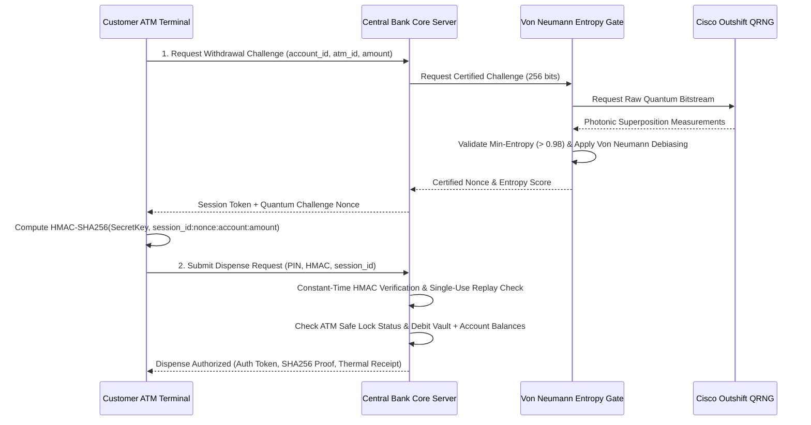

# Q-Vault: Quantum-Secured Core Banking & ATM Cash Management System

**Q-Vault** is a commercial-grade, production-ready FinTech core banking and automated teller machine (ATM) network prototype protected by a Hardware Security Module (HSM) running **Cisco Outshift Quantum Random Number Generator (QRNG)** and an entropy-certified **Von Neumann Entropy Gate**.

---

## 🌟 System Architecture & Surfaces

Q-Vault provides Role-Based Access Control (RBAC) across two primary surfaces accessible via the global header switcher:

### 1. 🏧 Customer ATM & Banking Portal (User Access)
- **Holographic Quantum Debit Card**: Real-time balance display, EMV chip visual, contactless quantum badge, and customer account details.
- **Pre-Registered Customer Accounts**:
  - `ACC-4921`: John Doe — Checking: $14,250.00 | PIN: `1234`
  - `ACC-8812`: Sarah Connor — Savings: $28,900.00 | PIN: `5678`
  - `ACC-3104`: Tech Corp Payroll — Corporate: $145,000.00 | PIN: `9999`
- **Interactive Cash Withdrawal Terminal**:
  - Quick-amount presets ($50, $100, $500, $1,000) or custom amount input.
  - Multi-terminal routing (`ATM-01 Manhattan 5th Ave`, `ATM-02 JFK Airport`, `ATM-03 Wall Street`).
  - **4-Step Quantum Handshake**:
    1. Query Cisco QRNG & Von Neumann Entropy Gate for 256-bit unguessable nonce.
    2. Compute device HMAC-SHA256 signature using customer's HSM-registered secret.
    3. Central Bank constant-time verification & single-use replay check.
    4. Hardware dispenser shutter opens with cash ejection animation (`[💵 Dispensing $500.00 in $50 bills...]`).
- **Digital Quantum Audit Receipt**:
  - Thermal receipt modal with printable receipt showing timestamp, ATM ID, amount, remaining balance, and cryptographic proof (`Nonce SHA-256 Digest [VERIFIED]`, min-entropy score).
- **Interbank Quantum Transfer**: Send money between accounts secured by Quantum OTP challenge.

### 2. 🛡️ Bank Admin & Security Operations Center (Admin Access)
- **Admin Clearance**: Credentials `admin` / `admin_quantum_secure` (or 1-click Demo Login).
- **ATM Fleet Safe Registry**: Real-time physical safe cash gauges vs. capacity, online/locked status, and 1-click **Emergency Remote Safe Lock** toggle.
- **Fraud & ATM Jackpotting Attack Center**:
  - **"Simulate ATM Jackpotting Attack"**: Demonstrates an attacker tapping into an ATM bus attempting to replay a previously captured $500 dispense packet.
  - Triggers instant automated safe lockdown of `ATM-01` and alerts the SOC:
    `[CRITICAL FRAUD DETECTED: REPLAY ATTACK BLOCKED - NONCE ALREADY CONSUMED. ATM-01 SAFE AUTOMATICALLY LOCKED DOWN]`
- **Central Bank Quantum HSM Health**: Real-time status for Cisco QRNG Engine, Entropy Gate debiasing status (>0.980 bits/bit), daily protected volume, and blocked replay attempts.
- **Live Streaming Core Transaction Ledger**: Dynamic audit ledger of all bank operations with color-coded verification status badges (`APPROVED`, `BLOCKED`).

---

## 🔒 Cryptographic Handshake Protocol



---

## 🚀 Getting Started

### 1. Backend (FastAPI Server)
```powershell
cd backend
python run.py
```
- API Docs: `http://127.0.0.1:8000/docs`
- Backend runs on `http://127.0.0.1:8000`

### 2. Frontend (React + Vite + Tailwind)
```powershell
cd frontend
npm.cmd run dev
```
- UI available at `http://localhost:5173`
- Full in-browser simulation fallback is provided, so the UI can run standalone even before the backend is started.

### 3. Production Build
```powershell
cd frontend
npm.cmd run build
```
Built files are automatically packaged into `frontend/dist/` and served statically by the FastAPI server when available.
