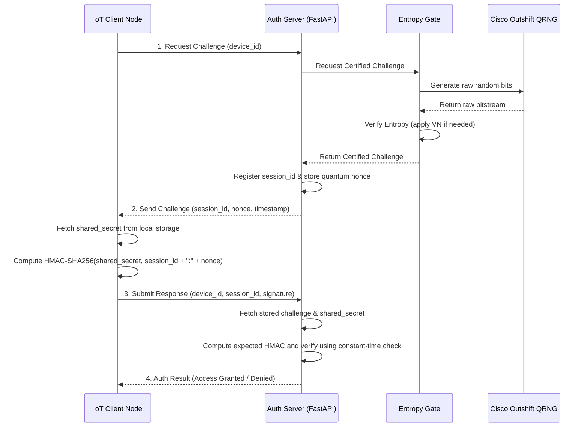

# Quantum Random Number Generator for Challenge-Response Authentication

This repository contains the complete full-stack software prototype for the research paper:  
**"Design and Analysis of a Quantum Random Number Generator for Challenge-Response Authentication"**

This system demonstrates a secure cryptographic challenge-response protocol where the authentication server issues random challenges generated by a true quantum random number generator (QRNG) powered by the **Cisco Outshift QRNG API**. An **Entropy Gate** module ensures cryptographic quality of every challenge using Von Neumann post-processing.

---

## 🏗️ Repository Architecture

The project is structured into three self-contained modules:

```
qrng-auth-prototype/
├── backend/
│   ├── app/
│   │   ├── __init__.py
│   │   ├── main.py            # FastAPI Server (IoT / Edge gateway API)
│   │   ├── qrng.py            # Cisco Outshift QRNG integration & PRNG Fallback
│   │   ├── entropy_gate.py    # Entropy validation and Von Neumann correction
│   │   └── config.py          # Shared keys registry & configuration
│   ├── requirements.txt       # Python package dependencies
│   └── run.py                 # Backend launch script
├── frontend/
│   ├── src/
│   │   ├── App.jsx            # Interactive React console UI
│   │   ├── index.css          # Tailwind CSS and cyber-effects stylesheet
│   │   └── main.jsx           # React app mount
│   ├── package.json           # npm dependencies
│   ├── tailwind.config.js     # Tailwind compilation config
│   ├── postcss.config.js      # PostCSS config
│   ├── vite.config.js         # Vite dev-server config
│   └── index.html             # UI HTML entry point
├── analysis/
│   └── noise_analysis.py      # Entropy comparison (PRNG vs Cisco Raw vs VN)
├── entropy_tests/
│   ├── nist_tests.py          # 15 NIST SP 800-22 Tests simulation
│   └── README.md              # Instructions for running the C reference test suite
├── .env.example               # Environment variables template
└── README.md                  # This file
```

---

## 🔒 The Cryptographic Protocol

The challenge-response handshake works as follows:



---

## ⚡ Quickstart Setup

This project uses an integrated structure where the FastAPI backend dynamically serves the built React frontend application.

### 1. Initial Setup

1. Create your environment variables file:
   ```bash
   cp .env.example .env
   ```
   **Edit `.env` and add your Cisco Outshift API Key:**
   `CISCO_QRNG_API_KEY="your_api_key_here"`

2. Navigate to the backend directory and install dependencies:
   ```bash
   cd backend
   pip install -r requirements.txt
   ```

### 2. Launching the Integrated App

You can start the entire application (Backend + Frontend UI) using the root launch script:
```powershell
.\start_app.ps1
```
*(Alternatively, just run `python run.py` inside the `/backend` folder)*

Once started, the backend API and the interactive UI console will be available at:
👉 **http://127.0.0.1:8000**

---

### 3. Entropy Validation (NIST SP 800-22) & Noise Analysis

To run the comparative analysis on the Cisco QRNG vs PRNG:
```bash
python analysis/noise_analysis.py
```

To run the complete 15 NIST tests validation:
```bash
python entropy_tests/nist_tests.py
```
